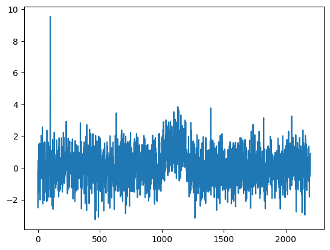

# CAPA online 

## Installation

To install the **capa_online** package from github using pip

 

```bash
python -m pip install 'git+https://github.com/grosed/capa_online/#egg=capa_online&subdirectory=package'
```

## Basic Usage

### use latest version from github


```python
!python -m pip uninstall -y capa_online
!python -m pip install 'git+https://github.com/grosed/capa_online/#egg=capa_online&subdirectory=package'
```

    Found existing installation: capa_online 1.1.1
    Uninstalling capa_online-1.1.1:
      Successfully uninstalled capa_online-1.1.1
    Collecting capa_online
      Cloning https://github.com/grosed/capa_online/ to /tmp/pip-install-wj9w_u_p/capa-online_9cca228a108949819b62cff51794118a
      Running command git clone --filter=blob:none --quiet https://github.com/grosed/capa_online/ /tmp/pip-install-wj9w_u_p/capa-online_9cca228a108949819b62cff51794118a
      Resolved https://github.com/grosed/capa_online/ to commit 552575a7322362f5a3a1db6ba9b0f3193df45cdf
      Installing build dependencies ... [?25ldone
    [?25h  Getting requirements to build wheel ... [?25ldone
    [?25h  Preparing metadata (pyproject.toml) ... [?25ldone
    [?25hRequirement already satisfied: pymonad in ./env/lib/python3.10/site-packages (from capa_online) (2.4.0)
    Building wheels for collected packages: capa_online
      Building wheel for capa_online (pyproject.toml) ... [?25ldone
    [?25h  Created wheel for capa_online: filename=capa_online-1.1.1-py3-none-any.whl size=3956 sha256=b7b81edc2f9c225904d189141db36737af72be95c81dff55ee98a7cd68c98a0d
      Stored in directory: /tmp/pip-ephem-wheel-cache-crs0mhe7/wheels/38/97/24/8f3a0b13105a57d8452e1ff75281b050f0b4f31833200b81f7
    Successfully built capa_online
    Installing collected packages: capa_online
    Successfully installed capa_online-1.1.1


### Example 1 - change in mean

#### Generate data 


```python
# create a simple example time series
import numpy as np

np.random.seed(1)
Z = [float(z) for z in list(np.random.normal(3, 5, 2000)) + 
    list(np.random.normal(10, 5, 200)) + # collective anomaly
    list(np.random.normal(3, 5, 1000))]
Z[1100] = 50 # point anomaly

# visualise the data
import matplotlib.pyplot as plt

plt.plot(Z)

```


    [<matplotlib.lines.Line2D at 0x776123647910>]


    

    


#### Determine the underlying distribution using 1000 points for "burn in" period and create a transformer.


```python
from capa_online import *
from statistics import mean,stdev

burn_in = Z[:1000]
transformer = scale(mean(burn_in),stdev(burn_in))

Z = Z[1000:]

plt.plot(Z)
```


    [<matplotlib.lines.Line2D at 0x776123176110>]


    

    


#### Create a cost function with a window size of 500 and calculate penalties


```python
from math import log
wsize = 500
cost = capa_normal_mean(wsize)
beta = 4*log(wsize)
beta_dash = 3*log(wsize)
```

#### Create a CAPA "scanner" from the cost and the transformer


```python
scanner = compose(capa(cost,beta,beta_dash),transformer)
```

#### Simulate a stream of data using the time series, scan the data using CAPA, and store the change history.


```python
history = list()
for z in Z :
    changes = scanner(z)
    history.append(changes)
```


```python
history[100]
```


    [99]


```python
history[1399]
```


    [(97, 293)]


```python
Y = [transformer(z) for z in Z]
plt.plot(Y)
```


    [<matplotlib.lines.Line2D at 0x776121d69db0>]


    

    


#### Save results for plotting


```python
import dill as pickle # needed to pickle closures
file = open('anomaly_history', 'wb')
pickle.dump((history,Z,wsize), file)
file.close()
```

#### Restarting


```python
cost = capa_normal_mean(wsize)
scanner = compose(capa(cost,beta,beta_dash),transformer)
```


```python
history = list()
for z in Z[:300] :
    changes = scanner(z)
    history.append(changes)
```


```python
history[-1]
```


    [99]


```python
# save and delete
file = open('scanner','wb')
pickle.dump(scanner,file)
file.close()
del(scanner)
```


```python
# reload
file = open('scanner', 'rb')
scanner = pickle.load(file)
file.close()
```


```python
for z in Z[300:] :
    changes = scanner(z)
    history.append(changes)
```


```python
history[1300]
```


    [(196, 392)]


### Example 2 - change in mean and variance


```python
# create a simple example time series
import numpy as np

np.random.seed(1)
Z = [float(z) for z in list(np.random.normal(3, 5, 2000)) + 
    list(np.random.normal(10, 5, 200)) + # collective anomaly - change in mean
    list(np.random.normal(3, 5, 200)) + 
    list(np.random.normal(3, 1, 200)) + # collective anomaly - change in variance
    list(np.random.normal(3, 5, 600))]
Z[1100] = 50 # point anomaly

# visualise the data
import matplotlib.pyplot as plt

plt.plot(Z)
```


    [<matplotlib.lines.Line2D at 0x7761213ae860>]


    

    


```python
burn_in = Z[:1000]
transformer = scale(mean(burn_in),stdev(burn_in))

Z = Z[1000:]

plt.plot(Z)
```


    [<matplotlib.lines.Line2D at 0x77612092f100>]


    

    


#### Create a cost function with a window size of 500 and calculate penalties


```python
wsize = 500
cost = capa_normal_mean_var(wsize)
beta = 4*log(wsize)
beta_dash = 3*log(wsize)
```

#### Create a CAPA "scanner" from the cost and the transformer


```python
scanner = compose(capa(cost,beta,beta_dash),transformer)
```


```python
history = list()
for z in Z :
    changes = scanner(z)
    history.append(changes)
```


```python
history[1450]
```


    [(46, 242)]


